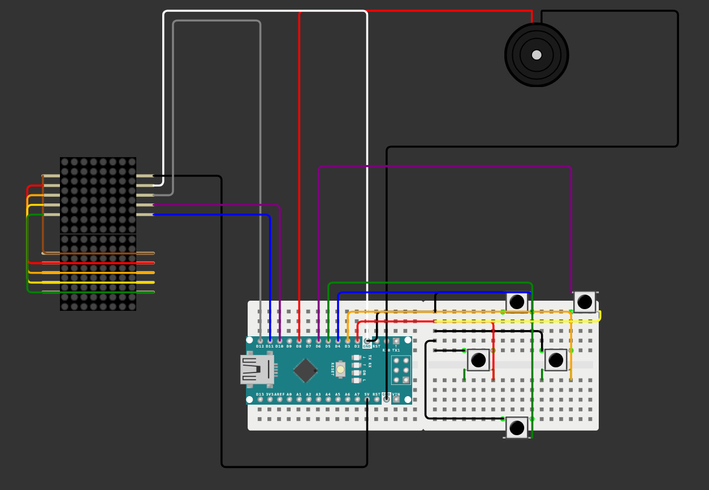
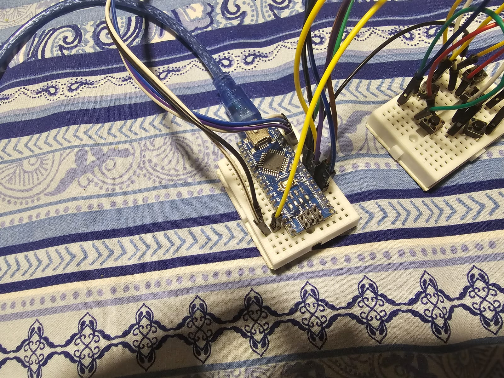
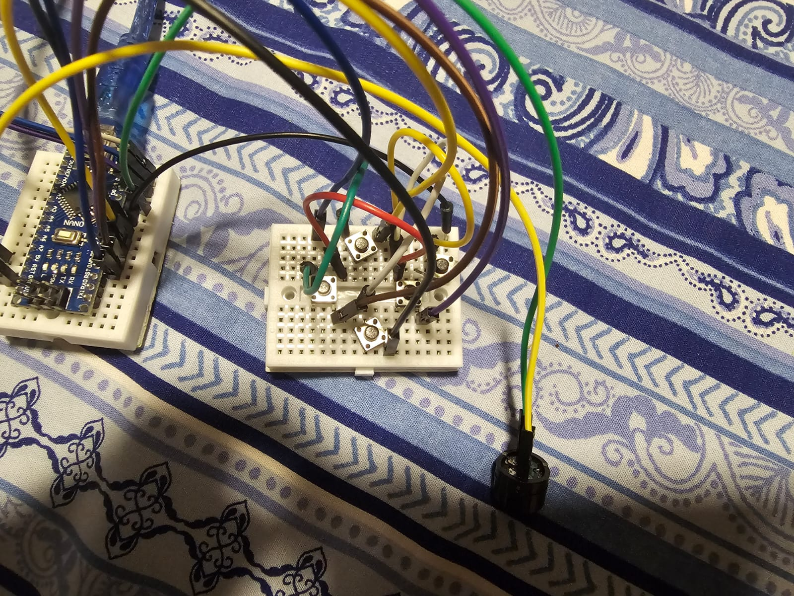
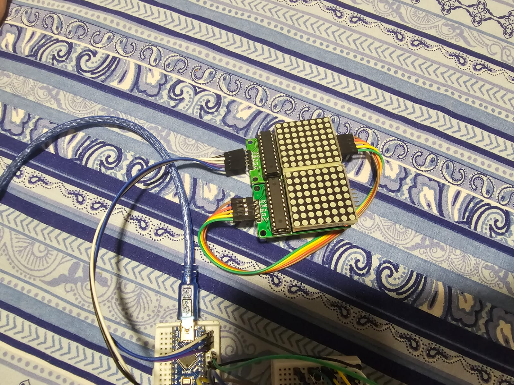

# Projeto - Tetris com Arduíno

> Projeto desenvolvido para a disciplina de Eletrônica para Computação — [USP-ICMC] · [2026.1]

---

## Integrantes

| Nome | NUSP |
|------|------|
| Luís Henrique Varela Medeiros Bezerra | 17908549 |
| Henrique Rossi Posso | 17868285 |
| Luís Fernando de Oliveira Souza | 17931682 |
| Malick Figueiredo Samoa | 16988652 |

---

## Descrição do Projeto

O projeto é um jogo de Tetris usando um Arduíno Nano, duas matrizes de led 8x8 em cascata com chip de controle MAX7219, 5 chaves tácteis (botões) e um buzzer passivo.

---

## Lista de Componentes

| Qtd | Componente | Valor / Especificação | Preço Unitário | Preço Total |
|-----|------------|----------------------|----------------|-------------|
| 1 | Arduíno Nano | Pinos soldados, com cabo USB | R$ 29,25 | R$ 29,25 |
| 10 | Cabo Jumper | Macho x Fêmea | R$ 0,70 | R$ 7,00 |
| 10 | Cabo Jumper | Fêmea x Fêmea | R$ 0,70 | R$ 7,00 |
| 10 | Micro Chave Tactil (Botões) | 6x6x5mm 4t | R$ 1,49 | R$ 14,90 |
| 2 | Protoboard | Mini 170 furos | R$ 6,90 | R$ 13,80 |
| 2 | Matriz Led 8x8 | Chip MAX7219 de controle | R$ 0,00 | R$ 0,00 |
| | | | **Total** | **R$ 71,95** |

---

OBS: as matrizes de led foram emprestadas pelo Simões, e cabos jumper macho x macho adicionais são necessários também, porém havíamos de sobra do outro projeto.

---

## Simulação no Wokwi

Utilizamos o Wokwi porque o TinkerCAD não possui as matrizes de led 8x8 para simulação. O zip com o código e os arquivos também está disponível no repositório, se desejado (basta copiar os conteúdos do json e do sketch para a área respectiva no wokwi).

---

## 📸 Fotos do Circuito Montado

### Arduino

### Controle (botões)

### Matrizes de Led

---

## Vídeo do Projeto

Assista ao vídeo do funcionamento do projeto:

---
